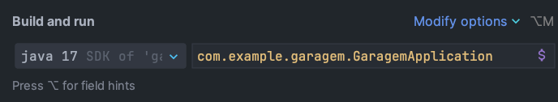
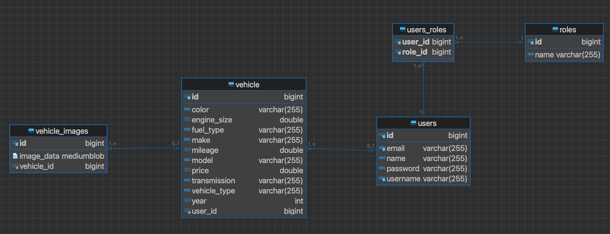

# Garagem API

Bem-vindo à documentação da API Garagem, uma aplicação para a gestão de veículos. Esta API permite criar, visualizar, atualizar e excluir informações de veículos e suas imagens associadas.

## Configuração do Ambiente

Certifique-se de que você tem as seguintes ferramentas instaladas em seu sistema:

- **Java**: Certifique-se de ter o Java Development Kit (JDK) instalado. Você pode fazer o download em [OpenJDK](https://openjdk.java.net/).
- **Maven**: O Maven é usado para construir o projeto e gerenciar suas dependências. Você pode fazer o download em [Maven](https://maven.apache.org/).
- **Docker**: O Docker é usado para executar o banco de dados MySQL e o Adminer. Você pode fazer o download em [Docker](https://www.docker.com/).

   - JVN: `java version 17`
   - SDK: `javac 17`
   - MVN: `Apache Maven 3.8.6`
   - DOCKER: `Docker version 20.10.8`
   - 


## Como Executar o Projeto

Siga as etapas abaixo para configurar e executar o projeto:

1. Clone este repositório:

   ```bash
   git clone https://github.com/seu-usuario/garagem-api.git
   
2. Limpe o cache do maven e execute o install do projeto

   ```bash
   mvn clean install
   
3. Inicie os containers MySQL e o Adminer

   ```bash
   docker-compose up

4. Inicie o projeto

   ```bash
   mvn spring-boot:run

## Sobre o projeto

O projeto consiste em uma API de gestão de veículos.
As portas configuradas do projeto são:

Adminer: ```http://localhost:8080/```
API: ```http://localhost:8081/```

Configuração do Banco de Dados MySQL
````
spring.datasource.url=jdbc:mysql://localhost:6612/keyslocal
spring.datasource.username=root
spring.datasource.password=123456
````

### Entidades do projeto



### Documentação

O Projeto conta com uma collection do postman contendo todos os endpoints
https://documenter.getpostman.com/view/23680860/2s9YXiaN17#c06282a3-de93-410e-8370-1c25b0a95cd8

### Principais endpoints

#### Users
- POST /api/auth/register: Registro de novos usuários
- POST /api/auth/login: Autenticação de um usuário e retorna um token de acesso JWT

#### Vehicles
- GET /api/vehicles: Obtém a lista de todos os veículos.
- GET /api/vehicles/{vehicleId}: Obtém informações detalhadas de um veículo pelo ID.
- POST /api/vehicles: Cria um novo veículo.
- PUT /api/vehicles/{vehicleId}: Atualiza informações de um veículo existente.
- DELETE /api/vehicles/{vehicleId}: Exclui um veículo.

#### Upload de imagens
- POST /api/vehicles/uploadImage/{vehicleId}: Carrega uma imagem para um veículo específico com base no ID do veículo
- GET /api/vehicles/images/{vehicleId}: Retorna uma lista de imagens no formato base64 de um veículo com base no ID fornecido
